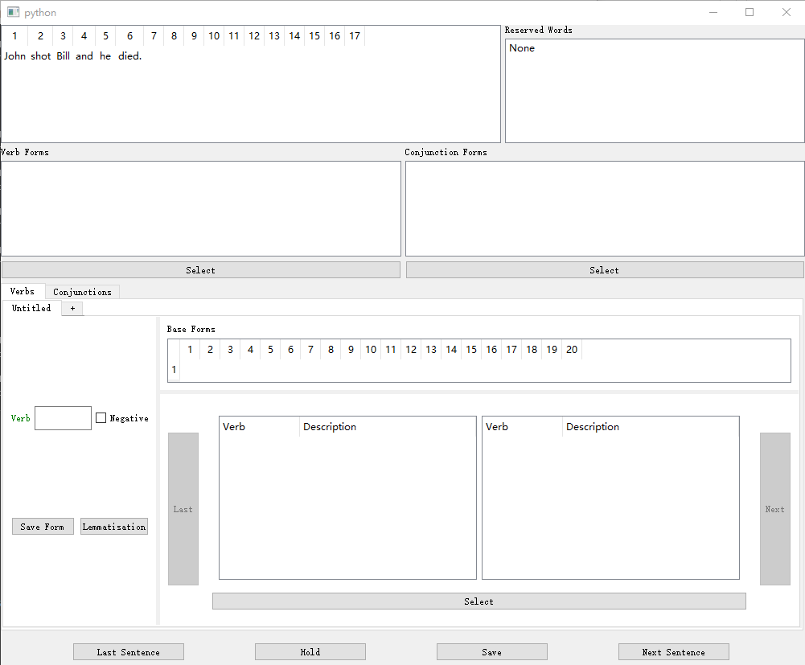

# **annotation-tool-for-VC**
This is an annotation tool for semantic representation VC.

# ** Operation Demo **
An operation demo is available in folder "video".

# **Files Structure** 
* datas --
 *contains data files to be annotated*
* frames --
 *contains PropBank's verb entries*
* res --
 *contains resource files*
* annotationTool.py --
 *the topest class of this project which provides the whole GUI*
* verbWidget.py --
 *provides the GUI for annotating verbs*
* conjunctionWidget.py--
 *provides the GUI for annotating conjunctions*
* TreeWidget.py --
 *provides Tree-style GUI*
* comListWidget.py --
 *provides the list-style GUI*
* xmlParse.py --
 *provides functions to extract information from PropBank entries that are stored as XML files.*
* search.py --
 *finds the base form of verbs*
* utilities.py --
 *provides some useful functions*
* noreg.txt --
 *stores different tenses of common verbs*

# Run 
python3 annotationTool.py

# Requirement
python3 
PyQt5

# GUI

